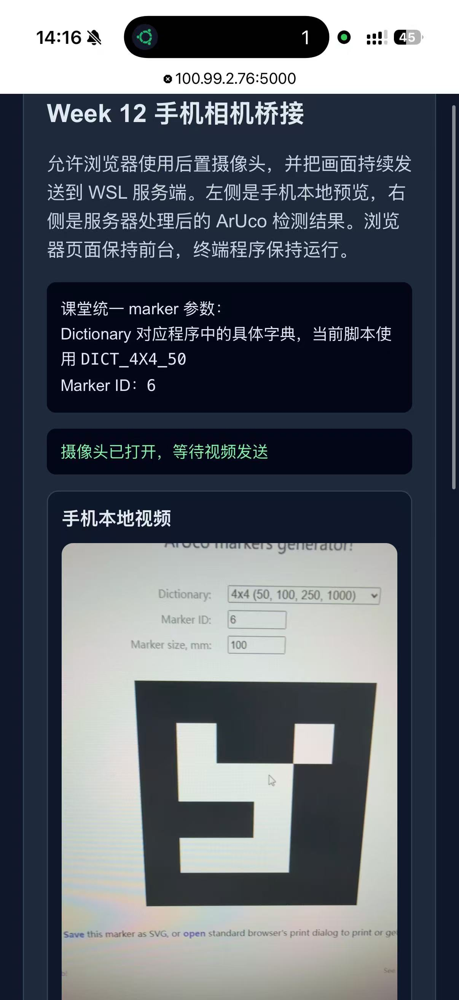
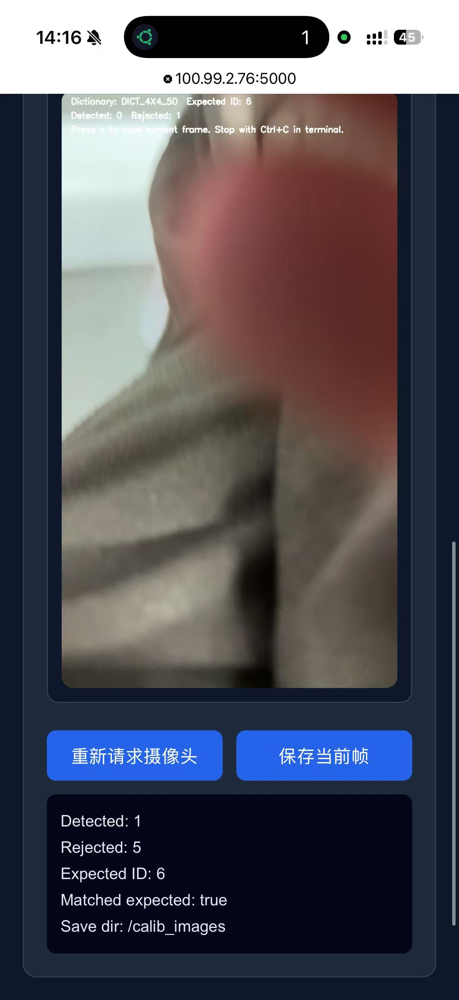

# week13作业记录：

## 第十三周课程内容：
### 课程内容：手机摄像头、ArUco 识别与距离测量
手机摄像头 作为视觉输入
WSL Ubuntu 作为开发环境
Tailscale 作为手机与 WSL 之间的网络桥梁
OpenCV + ArUco 完成识别与测距

iPhone / iPad：先打开 Tailscale，再打开 SSH 客户端，避免 VPN 没连上
Android：注意有些系统会限制后台网络权限，若连接超时，先确认 Tailscale 和 SSH 客户端都没有被系统省电策略挂起
第一次连接时看到主机指纹确认提示，选择接受即可

本周课堂统一采用：

手机浏览器
HTML5 摄像头
Tailscale
老师提供的 WSL 接收脚本
这样安排的目的，是让学生先把整条链路跑通，再逐步理解代码内部发生了什么。

换句话说，本节课前半段的重点不是先讲 Flask、SocketIO 或 WebSocket 细节，而是先让大家完成一个非常明确的操作目标：

让手机浏览器打开摄像头，并把画面送到 WSL 里的 OpenCV 窗口。

这样做的好处是：

iPhone 和 Android 用的是同一套方案
学生不需要安装额外的摄像头 App
课堂操作步骤更统一
更适合先运行，再逐步理解
姓名：여세걸

